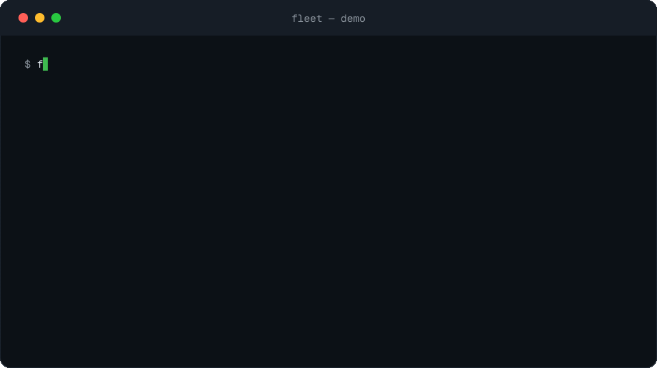
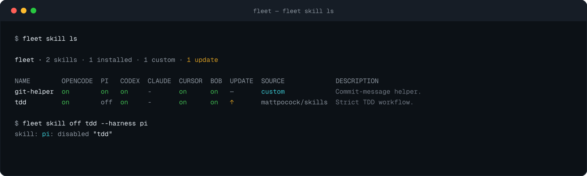
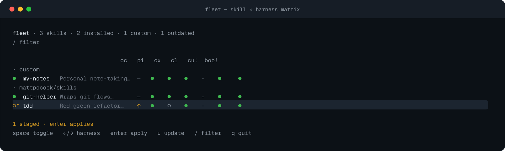

# Fleet

Fleet manages agent skills across AI coding agents — OpenCode, Codex, Claude Code, and more. Turn a skill off for one harness without uninstalling it: the [`skills` CLI](https://github.com/vercel-labs/skills) stays the install and update backend, and the canonical store (`~/.agents/skills`) is never moved or edited. Fleet keeps a state file as the source of truth and projects it into each harness's own config.



| `fleet skill ls` + `off`                         | Interactive matrix (`fleet`)                             |
| ------------------------------------------------ | -------------------------------------------------------- |
|  |  |

Regenerate with `pnpm --filter www demo:render` (`www/scripts/demo/render.mjs` renders the SVG terminal windows; content mirrors the `fleet skill ls` shape in `www/src/content/docs/cli.md` and the matrix glyphs in `internal/tui/view.go`).

## Supported OS

| OS      | Supported |
| ------- | --------- |
| macOS   | ✅        |
| Linux   | ✅        |
| Windows | ❌        |

Fleet ships arm64 and x86_64 builds for macOS and Linux.

## Supported harnesses

| Harness     | Per-skill off switch |
| ----------- | -------------------- |
| OpenCode    | ✅                   |
| Pi          | ✅                   |
| Codex       | ✅                   |
| Claude Code | ✅                   |
| Cursor      | ❌                   |
| IBM Bob     | ❌                   |

Cursor and Bob read the canonical store natively and have no per-skill off
switch; fleet says so instead of pretending. See the [per-harness
reference](www/src/content/docs/harnesses.md) for detection paths, written
shapes, and limitations.

## Installation

Three ways to install the same single static binary with no runtime
dependencies: a shell script, npm, or Go. Release builds report their version
through `fleet --version`; `go install` builds report `dev`. Every variant is
on the [Installation](https://fleet.zzacong.com/installation/) docs page.

```sh
curl -fsSL https://raw.githubusercontent.com/zzacong/fleet/main/install.sh | sh   # script → ~/.local/bin
```

```sh
npx -y @zzacong/fleet --version   # npm: try it without installing (pnpm dlx, bunx too)
npm i -g @zzacong/fleet           # …or install globally (pnpm add -g, bun add -g)
```

```sh
go install github.com/zzacong/fleet/cmd/fleet@latest
```

## The three-command tour

```sh
fleet skill ls          # what is installed, where it is active, what is stale
fleet skill off tdd     # turn a skill off for every harness (--harness to pick one)
fleet                   # the interactive skill × harness matrix
```

Bare `fleet` opens the matrix: one screen, every skill against every installed harness, toggles staged and applied together, and `u` running a one-key update-all — the same wrapped `skills update` the `skill update` verb runs, with the matrix reloading when it lands. It needs a terminal — piped output falls back to the `fleet skill ls` listing.

The remaining verbs round out the loop: `skill on` re-enables, `skill update` wraps `skills update` and keeps disabled skills disabled, `skill pull` clones and fast-forwards your customs repos, `skill adopt` migrates custom skills into a collection, `skill doctor` explains anything fleet would change, `skill sync` repairs drift on demand, and `harness ls` shows which of the six supported harnesses are installed and which have a per-skill off switch. Every verb is documented with examples in the [command reference](www/src/content/docs/cli.md).

## Customs repos: one-command setup

```sh
fleet skill pull git@github.com:me/my-customs.git          # fresh machine: clone into the auto-tracked fleet-home slot
fleet skill pull                                            # later, on any machine: fast-forward every tracked repo
fleet skill pull https://github.com/me/team.git ~/Developer/team-customs  # out-of-band checkout, remembered
```

Fleet tracks many versioned customs homes as one ordered set: the explicit repo-root list in `~/.config/fleet/config.json` (list order is precedence order), plus every checkout under `~/.config/fleet/repos/` auto-tracked by convention with no config write. A pull with no path derives the slot name from the URL; an explicit path inside fleet home stays convention-tracked; an explicit path outside fleet home is appended once to the explicit list (no duplicates, no reordering). Bare `skill pull` fast-forwards every tracked repo and prints a per-repo report (`updated`, `current`, `skipped`, `failed`); a fresh clone reports `cloned`; re-pulling an existing checkout is fast-forward-only, so dirty or diverged trees fail with their state surfaced instead of being merged away. After every clone or pull the collection is wired into the config-path harnesses, linked for the link-based harnesses, and synced. `fleet skill drop <path-or-name>` is the removal verb: an explicit repo is unlisted from the list with the disk untouched, while a fleet-home checkout is deleted from disk.

## Custom vs installed

Two kinds of skill show up in `fleet skill ls`, and the split decides how each one travels:

- **Installed** skills came from a source repo through the `skills` CLI and have provenance (source, hash) in its lockfile. They live in the canonical store (`~/.agents/skills`), `ls` groups them by source repo, and the update badge compares the recorded hash against the repo's current tree. Install and update them with the `skills` CLI, never by hand.
- **Custom** skills are your own: no lockfile entry. They live in the tracked set — versioned customs repos (the explicit out-of-band roots plus every `~/.config/fleet/repos/` checkout) and the unversioned fleet-home fallback `~/.config/fleet/skills/` — never through the canonical store, so a custom skill can't be shadowed by a store link. Harnesses discover them through their own config (OpenCode, Pi) or a managed symlink (Codex, Claude Code, Cursor, Bob). When a name exists in more than one source, `ls` shows it once with precedence explicit-list order, then fleet-home checkouts alphabetically, then the fallback, then the canonical store; `fleet skill doctor` reports every collision as double presence.

`fleet skill adopt <name>` is the bridge: it moves a custom skill out of the canonical store into the adopt destination — `--into <skills-dir>` for one run, else the configured target (`fleet config set adopt-target ~/Developer/customs/skills`), else a numbered prompt over the tracked collections plus the always-offered fleet-home fallback — wires that home's path into every installed harness, and manages the symlinks. It also promotes a forked installed skill. Adoption is reversible by hand — see [undo and escape hatches](www/src/content/docs/undo.md).

## What fleet changes on disk

Exactly one thing per harness, in each harness's own config format: OpenCode gets a deny rule in `opencode.jsonc`, Pi a force-exclude in `settings.json`, Codex an `enabled = false` block in `config.toml`, Claude Code an `off` override in `settings.json`. Cursor and Bob read the canonical store natively and have no per-skill off switch; fleet says so instead of pretending. Custom skills add one wiring step: OpenCode and Pi get the adopt destination's path as an extra discovery source in the same file and dialect they already use, and link-based harnesses get a managed symlink in their skills dir pointing at the adopted skill — always inside the destination `ls` scans, never the canonical store, so sync never removes those links. Skills' files are never moved, renamed, or edited aside from an `adopt` move or a `pull` clone/update — [per-harness reference](www/src/content/docs/harnesses.md) has the full list of touched files, written shapes, and untouched ground.

## Shell completions

```sh
source <(fleet completion zsh)   # also: bash, fish, powershell
```

## Documentation

| Document                                                   | Audience                                                    |
| ---------------------------------------------------------- | ----------------------------------------------------------- |
| [Command reference](www/src/content/docs/cli.md)           | every verb, flag, and error, with examples                  |
| [Per-harness reference](www/src/content/docs/harnesses.md) | files touched, written shapes, limitations                  |
| [Undo and escape hatches](www/src/content/docs/undo.md)    | running `skills` by hand, resetting state, how sync decides |
| [Architecture](docs/architecture.md)                       | state file → adapters → sync, adding a harness              |
| [State file schema](www/src/content/docs/state-file.md)    | versioned, forward-compatible format                        |
| [Testing guide](docs/testing.md)                           | injected homes, fixture tests, `FLEET_HOME` sandboxes       |

## Development

```sh
pnpm run check    # fmt-check + lint + typecheck + Go lint/test — single entrypoint
pnpm run check:ci # lint + typecheck + Go lint/test — what CI runs (no fmt)
pnpm run fmt      # oxfmt + prettier (JS/TS/MD/Astro)
make fmt          # gofumpt (Go only)
make build        # bin/fleet, version stamped from git
```

The [architecture overview](docs/architecture.md) explains how the core fits together, and the [testing guide](docs/testing.md) covers the injected-home rule every test follows.
